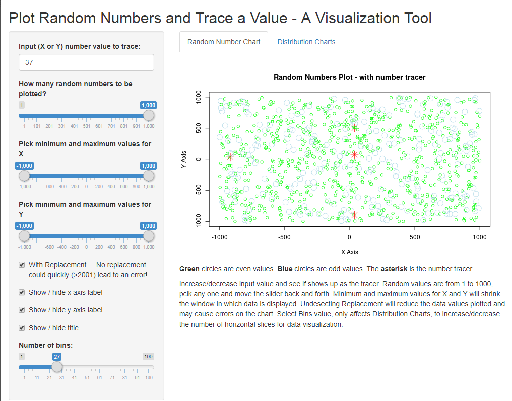
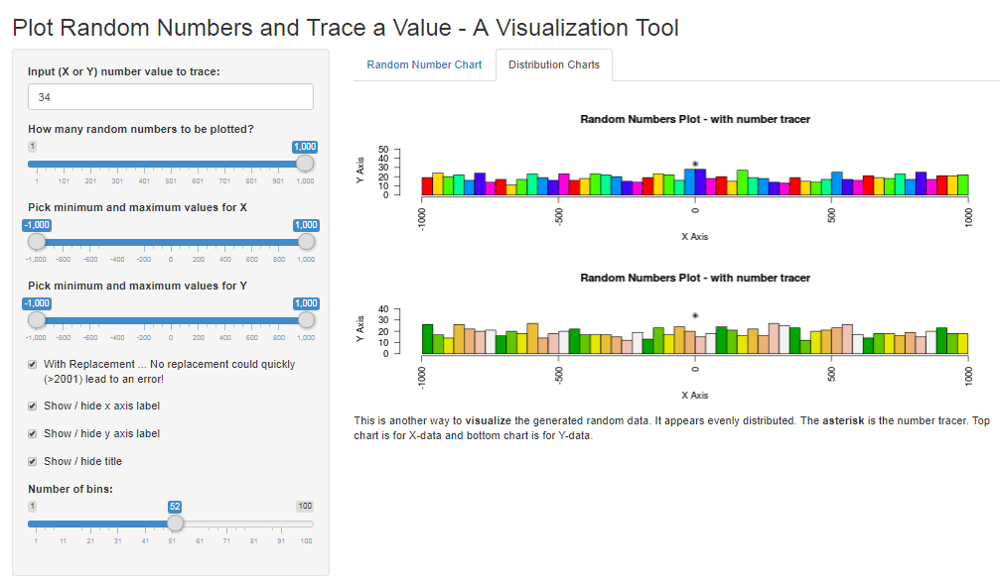

Developing Data Products
========================================================
author: geeagui
date: Thursday 12/7/2017
autosize: true
transition: linear
transition-speed: slow
font-family: 'monospace'
css: myCustomSlides.css
 

Your Shiny Application
========================================================

<br><br><font size="5">
Write a shiny application with associated supporting documentation. The documentation should be thought of as whatever a user will need to get started using your application.

- Deploy the application on Rstudio's shiny server
- Share the application link 
- Share your server.R and ui.R code on github

***
<strong>The application must include the following:</strong>

- Some form of input (widget: textbox, radio button, checkbox, ...)
- Some operation on the ui input in sever.R
- Some reactive output displayed as a result of server calculations
- You must also include enough documentation so that a novice user could use your application.
- The documentation should be at the Shiny website itself. Do not post to an external link.
</font>

The Shiny Application
========================================================


***
<h4>Random Number Fun</h4> 
<em><a target="_blank" href="https://geeagui.shinyapps.io/RandomNumberFun">Click here for link to App</a></em>

<span style="text-decoration: underline;">Instructions:</span><br>
<font size="4">
Increase/decrease <b>input value</b> and see if shows up as the tracer. <b>Random values</b> are from 1 to 1000, pick any one and move the slider back and forth. <b>Minimum and maximum</b> values for <b>X and Y</b> will shrink the window in which data is displayed. Unselecting <b>Replacement</b> will reduce the data values plotted on the chart. Select <b>Bins</b> value, only affects Distribution Charts, to increase/decrease the number of horizontal slices for data visualization.
</font>

Your Reproducible Pitch Presentation
========================================================
<font size="4.5">Now it is time to make the pitch. Use 5 slides (inclusive of the title slide) to pitch the app. Create a web page using Rstudio Presenter with an html5 slide deck.

We go through great effort to come up with reproducible data and algorithms. Since we cannot recreate survey, collected, or other forms of data (cost, lost opportunity, et al.), we reproduce it.   
- First pose the thesis statement or question that we would like to answer 
- Set aside an original copy of the raw data 
- Document the raw data (Readme), where it cames from and what it represents
- Document the changes to the raw data as we transform it into (tidy) a format more readily usable by the R Language
- Perform exploratory data analysis to determine which direction(s) to take it from there
- Perform analyses, draw inferences, create or train models
- Validate the process so far. Perhaps go back to a previous step or take a different turn
- Present (slides, markdown docs, et al.) and share (shiny.io, GitHub, et al.) the results in a reproducible fashion
</font>

Pitching Reproducible Research
========================================================
<em><a target="_blank" href="https://github.com/geeagui/RandomNumberFun">All code can be retrieved at this link</a></em><br> 
A snippet of code used to create the App... 

```r
# ui Random Number Fun
library(shiny)
# Define UI for application that draws random numbers
shinyUI(fluidPage(
  # Application title
  titlePanel("Plot Random Numbers and Trace a Value - A Visualization Tool"),
  # Sidebar with a slider input for values
  sidebarLayout(
    sidebarPanel(
      numericInput("tracer","Input (X or Y) number value to trace:",value=0,min=0,max=1000), 
      sliderInput("numeric","How many random numbers to be plotted?",value=500,min=1,max=1000,step=1),
      sliderInput("sliderX", "Pick minimum and maximum values for X", min=-1000, max=1000, value=c(-1000,1000)),
      sliderInput("sliderY", "Pick minimum and maximum values for Y", min=-1000, max=1000, value=c(-1000,1000)),
      checkboxInput("replacement",paste(strwrap("With Replacement",width=17),"... No replacement could quickly (>2001) lead to an error!",collapse="\n"), value=T),
      checkboxInput("show_xlab","Show / hide x axis label", value=T),
      checkboxInput("Show_ylab","Show / hide y axis label", value=T),
      checkboxInput("show_title","Show / hide title", value=T),
      sliderInput("bins","Number of bins:",min=1,max=100,value=50)
      ),
    
    # Show a plot of the generated distribution
    mainPanel(
      tabsetPanel(type="tabs",
                  tabPanel("Random Number Chart",br(),plotOutput("plot1"),p(strong('Green'),'circles are even values. ', strong('Blue'),'circles are odd values. ','The',strong('asterisk'),'is the number tracer.'),p("Increase/decrease input value and see if shows up as the tracer. Random values are from 1 to 1000, pick any one and move the slider back and forth. Minimum and maximum values for X and Y will shrink the window in which data is displayed. Undesecting Replacement will reduce the data values plotted and may cause errors on the chart. Select Bins value, only affects Distribution Charts, to increase/decrease the number of horizontal slices for data visualization.")),
                  tabPanel("Distribution Charts",br(),plotOutput("plot2"),p('This is another way to', strong('visualize'), 'the generated random data. It appears evenly distributed.','The',strong('asterisk'),'is the number tracer. Top chart is for X-data and bottom chart is for Y-data.'))
                  )
    )
  )
))
```

<!--html_preserve--><div class="container-fluid">
<h2>Plot Random Numbers and Trace a Value - A Visualization Tool</h2>
<div class="row">
<div class="col-sm-4">
<form class="well">
<div class="form-group shiny-input-container">
<label for="tracer">Input (X or Y) number value to trace:</label>
<input id="tracer" type="number" class="form-control" value="0" min="0" max="1000"/>
</div>
<div class="form-group shiny-input-container">
<label class="control-label" for="numeric">How many random numbers to be plotted?</label>
<input class="js-range-slider" id="numeric" data-min="1" data-max="1000" data-from="500" data-step="1" data-grid="true" data-grid-num="9.99" data-grid-snap="false" data-prettify-separator="," data-prettify-enabled="true" data-keyboard="true" data-keyboard-step="0.1001001001001" data-data-type="number"/>
</div>
<div class="form-group shiny-input-container">
<label class="control-label" for="sliderX">Pick minimum and maximum values for X</label>
<input class="js-range-slider" id="sliderX" data-type="double" data-min="-1000" data-max="1000" data-from="-1000" data-to="1000" data-step="1" data-grid="true" data-grid-num="10" data-grid-snap="false" data-prettify-separator="," data-prettify-enabled="true" data-keyboard="true" data-keyboard-step="0.05" data-drag-interval="true" data-data-type="number"/>
</div>
<div class="form-group shiny-input-container">
<label class="control-label" for="sliderY">Pick minimum and maximum values for Y</label>
<input class="js-range-slider" id="sliderY" data-type="double" data-min="-1000" data-max="1000" data-from="-1000" data-to="1000" data-step="1" data-grid="true" data-grid-num="10" data-grid-snap="false" data-prettify-separator="," data-prettify-enabled="true" data-keyboard="true" data-keyboard-step="0.05" data-drag-interval="true" data-data-type="number"/>
</div>
<div class="form-group shiny-input-container">
<div class="checkbox">
<label>
<input id="replacement" type="checkbox" checked="checked"/>
<span>With Replacement ... No replacement could quickly (&gt;2001) lead to an error!</span>
</label>
</div>
</div>
<div class="form-group shiny-input-container">
<div class="checkbox">
<label>
<input id="show_xlab" type="checkbox" checked="checked"/>
<span>Show / hide x axis label</span>
</label>
</div>
</div>
<div class="form-group shiny-input-container">
<div class="checkbox">
<label>
<input id="Show_ylab" type="checkbox" checked="checked"/>
<span>Show / hide y axis label</span>
</label>
</div>
</div>
<div class="form-group shiny-input-container">
<div class="checkbox">
<label>
<input id="show_title" type="checkbox" checked="checked"/>
<span>Show / hide title</span>
</label>
</div>
</div>
<div class="form-group shiny-input-container">
<label class="control-label" for="bins">Number of bins:</label>
<input class="js-range-slider" id="bins" data-min="1" data-max="100" data-from="50" data-step="1" data-grid="true" data-grid-num="9.9" data-grid-snap="false" data-prettify-separator="," data-prettify-enabled="true" data-keyboard="true" data-keyboard-step="1.01010101010101" data-data-type="number"/>
</div>
</form>
</div>
<div class="col-sm-8">
<div class="tabbable">
<ul class="nav nav-tabs" data-tabsetid="8149">
<li class="active">
<a href="#tab-8149-1" data-toggle="tab" data-value="Random Number Chart">Random Number Chart</a>
</li>
<li>
<a href="#tab-8149-2" data-toggle="tab" data-value="Distribution Charts">Distribution Charts</a>
</li>
</ul>
<div class="tab-content" data-tabsetid="8149">
<div class="tab-pane active" data-value="Random Number Chart" id="tab-8149-1">
<br/>
<div id="plot1" class="shiny-plot-output" style="width: 100% ; height: 400px"></div>
<p>
<strong>Green</strong>
circles are even values. 
<strong>Blue</strong>
circles are odd values. 
The
<strong>asterisk</strong>
is the number tracer.
</p>
<p>Increase/decrease input value and see if shows up as the tracer. Random values are from 1 to 1000, pick any one and move the slider back and forth. Minimum and maximum values for X and Y will shrink the window in which data is displayed. Undesecting Replacement will reduce the data values plotted and may cause errors on the chart. Select Bins value, only affects Distribution Charts, to increase/decrease the number of horizontal slices for data visualization.</p>
</div>
<div class="tab-pane" data-value="Distribution Charts" id="tab-8149-2">
<br/>
<div id="plot2" class="shiny-plot-output" style="width: 100% ; height: 400px"></div>
<p>
This is another way to
<strong>visualize</strong>
the generated random data. It appears evenly distributed.
The
<strong>asterisk</strong>
is the number tracer. Top chart is for X-data and bottom chart is for Y-data.
</p>
</div>
</div>
</div>
</div>
</div>
</div><!--/html_preserve-->
